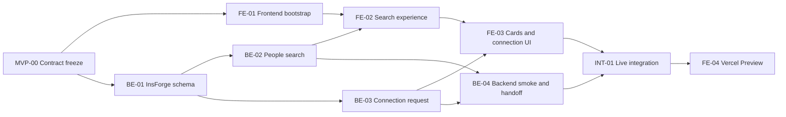

# Brea Two-Hour MVP Execution Plan

## Locked Decisions

- Product core: **find suitable people nearby**.
- Primary flow: natural-language search → nearby ranked profiles → match reason → connection request.
- Frontend: React, TypeScript, Vite, Tailwind CSS v3.4, and `@insforge/sdk`.
- Frontend hosting: Vercel static deployment with Git integration.
- Backend: InsForge Postgres and Deno Edge Functions.
- Function slugs: `people-search` and `connection-request`.
- Data boundary: frontend invokes Functions only; it cannot directly read or write base tables.
- MVP identity: `BREA_MVP_PROFILE_ID` is a server-side InsForge Function secret. Login UI is out of scope.
- Location: stored and evaluated in InsForge; raw coordinates never reach the browser.
- Search: deterministic relevance ranking plus a real radius filter. Do not claim that an AI model is running.
- Connection retries are idempotent and backed by a database unique constraint.
- Preview and Production Vercel deployments use separate InsForge targets.

## Ticket Format

Use GitHub Issues with one milestone named `Two-Hour MVP`. Avoid an Epic hierarchy for this timebox.

Recommended labels:

- `mvp`
- `priority:p0`
- `area:frontend`
- `area:backend`
- `area:integration`
- `blocked`

Issue title format:

```text
[MVP][FE] Short outcome
[MVP][BE] Short outcome
[MVP][INT] Short outcome
```

Every issue body should contain:

```md
## Outcome
One observable result.

## Dependencies
- Issue IDs or `None`.

## Acceptance criteria
- [ ] Verifiable behavior.

## Estimate
10–30 minutes.
```

## Dependency Map



## Shared Ticket

### MVP-00 — Freeze product and platform contract

- Owner: PM/Design + Backend
- Estimate: 10 minutes
- Dependencies: Vercel and InsForge access available

Acceptance criteria:

- [ ] Product core is recorded as “find suitable people nearby.”
- [ ] Function slugs are frozen as `people-search` and `connection-request`.
- [ ] Search, connection, and error JSON match `PRD.md`.
- [ ] Radius is fixed at 10 km for the initial UI.
- [ ] `BREA_MVP_PROFILE_ID` is confirmed as a server-side-only identity.
- [ ] Duplicate connection behavior is idempotent with `created: false`.
- [ ] Development, Preview, and Production InsForge targets are identified.
- [ ] Vercel team/project, Git repository, and `main` production branch are confirmed.
- [ ] Three successful example queries and one empty query are agreed.
- [ ] Login, maps, chat, Share Marketplace, vector search, and production auth remain out of scope.

## Frontend / PM-Design Tickets

### FE-01 — Bootstrap Vite, Vercel, Tailwind, and InsForge client

- Owner: Frontend
- Estimate: 20 minutes
- Dependencies: MVP-00

Acceptance criteria:

- [ ] React + TypeScript + Vite installs, starts, and builds.
- [ ] Tailwind CSS v3.4 and `@insforge/sdk` are installed.
- [ ] A single InsForge browser client uses `VITE_INSFORGE_URL` and `VITE_INSFORGE_ANON_KEY`.
- [ ] Missing environment configuration produces an explicit setup error.
- [ ] `.env*` local files and `.vercel/` are ignored; `.env.example` contains empty required keys.
- [ ] Vercel project is linked with framework `Vite`, root `.`, build `npm run build`, and output `dist`.
- [ ] Development, Preview, and Production each contain the two required Vite environment keys.
- [ ] No Next.js, React Router, raw Function URL, Vercel Function, or `vercel.json` is added.
- [ ] Lockfile is present and the responsive app shell renders.

### FE-02 — Build typed nearby-search experience

- Owner: Frontend
- Estimate: 25 minutes
- Dependencies: FE-01, BE-02

Acceptance criteria:

- [ ] `searchNearbyPeople()` invokes `people-search` through `insforge.functions.invoke()`.
- [ ] Adapter checks `{ data, error }` and validates the minimum response shape.
- [ ] Search body contains only `query`, `radiusKm`, and `limit`.
- [ ] Enter, CTA, and example chips all run the same submitted-query flow.
- [ ] Idle, loading, results, empty, Function error, and location-unavailable states are distinct.
- [ ] Empty state is triggered only by a successful empty result array.
- [ ] Retry preserves and resubmits the last submitted query.
- [ ] UI communicates that results are within 10 km.
- [ ] Backend ordering and match reasons are not recalculated in the browser.
- [ ] Form semantics, visible focus, and live status feedback are present.

### FE-03 — Complete profile cards and connection flow

- Owner: Frontend
- Estimate: 20 minutes
- Dependencies: FE-02, BE-03

Acceptance criteria:

- [ ] Cards show name, avatar or initials, headline, rounded distance, tags, availability, and match reason.
- [ ] Match reason and approximate distance have clear visual priority.
- [ ] Stable profile IDs are used as React keys.
- [ ] Avatar has alt text, lazy loading, and an error fallback.
- [ ] `sendConnectionRequest()` invokes `connection-request` through the SDK.
- [ ] Request body contains only `recipientId` and the last submitted query.
- [ ] Per-card state supports none, submitting, pending, and error.
- [ ] `Request sent` appears only after a valid successful Function response.
- [ ] A repeated request with `created: false` is treated as an idempotent success.
- [ ] The layout works at 375 px and 1440 px without exposing raw coordinates.

### FE-04 — Verify local build and Vercel Preview

- Owner: Frontend
- Estimate: 15 minutes
- Dependencies: FE-03, INT-01

Acceptance criteria:

- [ ] `npm run build` succeeds before deployment.
- [ ] Local production preview has no blocking console error.
- [ ] Feature-branch push produces a READY Vercel Preview.
- [ ] Preview bundle points to Preview InsForge, not Production.
- [ ] Three searches, the empty state, and one connection request work on the Preview URL.
- [ ] Mobile, desktop, keyboard, and visible-focus checks pass.
- [ ] README documents Vercel linking, env pull, dev, build, and environment requirements.
- [ ] Production deployment is rebuilt from `main`; a Preview artifact is not promoted across different InsForge environments.

## Backend Tickets

### BE-01 — Link InsForge and apply schema with deny-by-default RLS

- Owner: Backend
- Estimate: 25 minutes
- Dependencies: MVP-00

Acceptance criteria:

- [ ] `npx @insforge/cli current` identifies the intended project.
- [ ] A backend branch is used if the linked project contains shared or production data.
- [ ] One migration creates `public.profiles` and `public.connections`.
- [ ] Profile coordinates have valid-range checks and are never part of the public projection.
- [ ] Connections have sender/recipient foreign keys, a self-connection check, and a unique sender/recipient pair.
- [ ] Six to eight backend-managed profiles cover the agreed queries and a fixed MVP current profile exists.
- [ ] RLS is enabled and direct `anon`/`authenticated` table privileges are explicitly revoked.
- [ ] Idempotent connection RPC execution is revoked from public runtime roles.
- [ ] Migration applies successfully without manual transaction statements.

### BE-02 — Deploy nearby people-search Function

- Owner: Backend
- Estimate: 25 minutes
- Dependencies: BE-01

Acceptance criteria:

- [ ] Required Function secrets exist and no value is exposed to frontend or logs.
- [ ] `people-search` handles POST and OPTIONS with CORS headers on every response.
- [ ] Query, radius, and limit validation match the frozen contract.
- [ ] Function loads the server-side MVP profile and excludes it from results.
- [ ] Haversine distance is calculated in the Function and radius is a hard filter.
- [ ] Relevance is ranked before distance tie-breaking.
- [ ] Every result has an evidence-based `matchReason` and rounded `distanceKm`.
- [ ] Empty search returns `{ results: [] }`; raw coordinates never appear.
- [ ] Function is deployed and listed as `active`.

### BE-03 — Deploy idempotent connection-request Function

- Owner: Backend
- Estimate: 20 minutes
- Dependencies: BE-01

Acceptance criteria:

- [ ] `connection-request` handles POST and OPTIONS with CORS headers on every response.
- [ ] Sender comes only from the server-side MVP profile secret.
- [ ] Recipient must exist, be discoverable, and differ from sender.
- [ ] First request persists one pending connection and returns `created: true`.
- [ ] Retry returns the same connection and `created: false`.
- [ ] Concurrent or repeated calls cannot create a second sender/recipient pair.
- [ ] Errors use stable `{ code, message }` JSON without internal details.
- [ ] Function is deployed and listed as `active`.

### BE-04 — Run InsForge smoke, security check, and handoff

- Owner: Backend
- Estimate: 15 minutes
- Dependencies: BE-02, BE-03

Acceptance criteria:

- [ ] CLI invocation verifies three successful searches and one empty search.
- [ ] CLI invocation verifies connection first/retry behavior and one persisted row.
- [ ] An anon SDK direct read of both base tables fails.
- [ ] Function and Postgres logs contain no blocking errors or leaked secrets.
- [ ] Frontend receives only the InsForge URL, anon key delivery path, Function slugs, and successful example payloads.
- [ ] Preview and Production Function status is documented separately.

## Integration Ticket

### INT-01 — Complete live search-to-connection workflow

- Owner: Frontend + Backend
- Estimate: 15 minutes
- Dependencies: FE-03, BE-04

Acceptance criteria:

- [ ] A browser-origin request reaches both active Functions through `@insforge/sdk`.
- [ ] Three agreed queries return suitable profiles within 10 km.
- [ ] The empty query produces the intended empty state rather than an error.
- [ ] One connection is persisted and remains pending after a new search.
- [ ] Duplicate submission creates no second row.
- [ ] Function errors are recoverable without a page reload.
- [ ] Preview writes only to Preview InsForge data.

## Parallel Timeline

| Time | Frontend / PM-Design | Backend |
| --- | --- | --- |
| 0–10 | MVP-00 contract and copy freeze | MVP-00 project and contract freeze |
| 10–35 | FE-01 bootstrap and app shell | BE-01 migration, profiles, RLS |
| 35–60 | FE-02 UI states and typed adapter | BE-02 `people-search` |
| 60–80 | FE-02 live integration, begin FE-03 | BE-03 `connection-request` |
| 80–95 | FE-03 connection UI | BE-04 smoke and handoff |
| 95–110 | INT-01 and FE-04 Preview verification | INT-01 integration support |
| 110–120 | Contingency | Contingency |

## Cut Line

Never cut:

- Real radius filtering and backend-generated match reasons.
- InsForge Function integration through `@insforge/sdk`.
- Connection persistence and database uniqueness.
- Functions-only database boundary and RLS negative test.
- Loading, empty, Function error, and per-card connection states.
- Local production build and Vercel Preview verification.

Cut first if time is short:

1. Production deployment; keep the verified Preview.
2. Decorative images, animation, and skeletons.
3. Bio and nonessential tags.
4. Automated tests beyond build and smoke checks.
5. Custom CI, domain, analytics, vector search, formal auth, and AI ranking.

## Handoff Checkpoints

- T+10: frozen Function contract and environment targets.
- T+35: schema/RLS applied; Vercel and SDK client configured.
- T+60: `people-search` active.
- T+80: `connection-request` active.
- T+95: InsForge smoke evidence handed to frontend.
- T+110: verified Vercel Preview URL ready.
