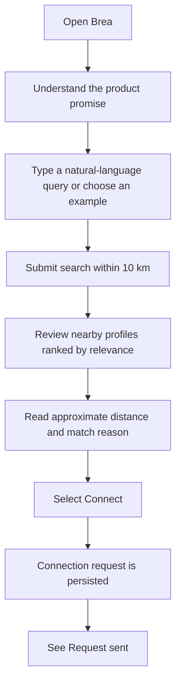
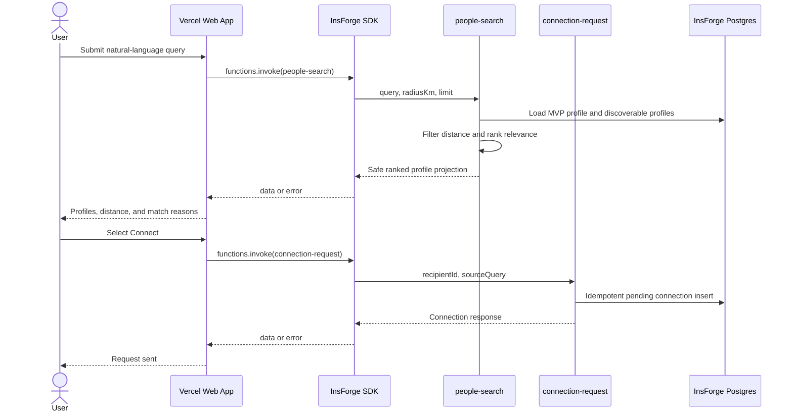

# Brea Web MVP User Flow

## 1. Flow Objective

Brea's MVP validates one product promise:

> Find suitable people nearby.

The user should be able to describe who they want to meet, understand why nearby profiles are relevant, and send a connection request in under one minute.

## 2. Happy Path



### Step 1 — Open Brea

The user lands on a single-page Vercel web app without a login screen. The page immediately presents:

- Brea's name and product promise.
- A natural-language search input.
- A visible 10 km search scope.
- Two or three example queries.

### Step 2 — Describe who they want to meet

The user enters a query or chooses an example, such as:

- “A product designer who enjoys hiking”
- “Someone who can help me practice Japanese”
- “A developer available for coffee”

An empty query does not trigger a request.

### Step 3 — Search nearby people

The frontend invokes the active InsForge Function `people-search` through `@insforge/sdk`.

```ts
{
  query: submittedQuery,
  radiusKm: 10,
  limit: 12,
}
```

While the request is in flight:

- The current query remains visible.
- Duplicate submissions are prevented.
- The interface exposes a loading status to assistive technology.

### Step 4 — Calculate proximity and relevance

The `people-search` Function:

1. Loads the server-side MVP profile and its location.
2. Excludes that profile from the candidate set.
3. Calculates distance and removes candidates outside 10 km.
4. Matches the query against profile headline, skills, interests, availability, and bio.
5. Ranks by relevance, using distance as a tie-breaker.
6. Produces an evidence-based `matchReason`.
7. Returns a safe projection with rounded distance and no coordinates.

### Step 5 — Review results

Every profile card displays:

- Name and avatar or initials.
- Professional headline.
- Approximate distance.
- Skills and interests.
- Availability.
- A match explanation such as “Matches product design and hiking.”
- Current connection state.
- A `Connect` action when no request is pending.

The frontend preserves the backend result order and does not recalculate relevance or distance.

### Step 6 — Send a connection request

When the user selects `Connect`, only that profile card enters a submitting state. The frontend invokes `connection-request` with:

```ts
{
  recipientId,
  sourceQuery: submittedQuery,
}
```

The frontend never sends sender identity or coordinates. The Function obtains the sender from the server-side MVP profile identity.

### Step 7 — Confirm persistence

The connection Function writes a pending connection to InsForge Postgres. The UI changes to `Request sent` only after a valid successful response.

Retries are idempotent:

- First request: `created: true`.
- Repeated sender/recipient request: same connection with `created: false`.
- The database contains only one sender/recipient pair.

## 3. System Interaction



## 4. UI State Model

### Search states

| State | Trigger | UI behavior |
| --- | --- | --- |
| Idle | Initial load | Show product promise, input, scope, and examples. |
| Loading | Search submitted | Preserve query, disable duplicate submit, show progress. |
| Results | Non-empty successful response | Render profiles in backend order. |
| Empty | Successful `{ results: [] }` | Explain no matches and offer a broader example or clear action. |
| Function error | SDK or Function failure | Preserve query and offer Retry. |
| Location unavailable | MVP profile has no usable location | Explain the setup issue; do not present it as an empty search. |
| Invalid response | Required response shape is missing | Render no profile data and show a recoverable error. |

### Per-profile connection states

| State | UI action |
| --- | --- |
| None | Show enabled `Connect`. |
| Submitting | Show `Sending…` and disable only this card. |
| Pending | Show completed `Request sent`. |
| Error | Restore `Connect` and show an inline retry message. |

## 5. Recovery Flows

### No nearby match

```text
Successful search with no results
  → Show a clear empty state
  → Suggest a broader skill, interest, or activity
  → Let the user edit or clear the query
```

### Search Function failure

```text
Function or network error
  → Keep the submitted query
  → Show a non-technical message
  → Retry the same submitted query
```

### Connection Function failure

```text
Connection request fails
  → Restore Connect on that profile
  → Keep other cards usable
  → Show an inline Retry action
```

## 6. MVP Identity and Location Limitation

The two-hour MVP does not include login or browser geolocation. Both Functions use a server-side `BREA_MVP_PROFILE_ID` stored as an InsForge Function secret.

Consequences:

- All visitors share one MVP sender identity.
- “Nearby” is relative to the MVP profile's stored location, not each visitor's live GPS position.
- The frontend cannot submit or alter sender identity or coordinates.
- The limitation must be disclosed in the README and demonstration notes.

Production authentication, per-user location, and location consent are post-MVP work.

## 7. Privacy and Security Boundary

- Browser code receives only the InsForge URL and anon key.
- Full-access API keys remain in InsForge Function secrets.
- Frontend clients cannot directly read `profiles` or `connections`.
- Functions return approximate distance but never latitude or longitude.
- Connection uniqueness is enforced in Postgres, not only by a disabled button.
- Preview Vercel deployments must write only to Preview InsForge data.

## 8. Out of Scope

This user flow ends at `Request sent`. It does not include:

- Account creation or login UI.
- Per-visitor browser geolocation.
- Recipient acceptance or connection inbox.
- Chat or notifications.
- Maps or precise locations.
- Profile editing.
- Share Marketplace.
- Production moderation, reporting, or blocking.
